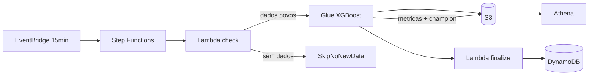

# AWS IA Regressão — Saldo Previsto

Template de automação AWS com pipeline ML **XGBoost** para previsão de saldo bancário. Combina S3, Glue, Lambda, Step Functions, EventBridge, DynamoDB e Athena — com **ingestão incremental a cada 15 minutos** em produção (configurável).

## Proposta de valor

Automatizar o **treino, a validação e a publicação** de previsões de saldo bancário, com rastreabilidade operacional e consulta analítica em SQL — sem servidor de aplicação.

| Para quem | Entrega |
|-----------|---------|
| **Engenharia de dados / ML** | Pipeline reprodutível (Glue + Step Functions), retreino a cada **15 min**, métricas (RMSE, WAPE, por segmento) e feature importance no S3 |
| **Analytics / negócio** | Tabela Athena com previsão vs. real, erro por cliente, segmento e período |
| **Operações** | Histórico de runs no DynamoDB, orquestração visível no Step Functions |

### Insight principal

> O modelo **não erra igual para todos**. A leitura mais útil combina **WAPE por segmento** (estável com saldos baixos) e erro por mês — não só R² global. **MAPE** permanece apenas como diagnóstico (oscila quando `saldo_real` é próximo de zero).

### Alvo e qualidade do modelo

| Aspecto | Comportamento |
|---------|----------------|
| **Alvo (`saldo_previsto`)** | Saldo do **próximo período** (`saldo_m1` shift por cliente), sem fórmula no mesmo período — evita vazamento de features |
| **Split** | Temporal **treino / validação / teste**; validação para early stopping; métricas finais no teste |
| **Métrica principal** | **RMSE** (promoção champion) e **WAPE** (monitoramento e negócio) |
| **Diagnóstico** | MAPE, SMAPE, R² |

### Onde ver evolução e qualidade

| Fonte | O que mostra | Uso |
|-------|----------------|-----|
| **Athena** `tb_saldo_previsto_prod` | Predições, `erro_absoluto`, `erro_percentual`, `modelo_versao` | WAPE/MAE por segmento e mês nas predições publicadas |
| **Athena** `tb_metricas_treino` | RMSE, WAPE, SMAPE, MAPE, `metricas_segmento` (JSON), `is_champion` | Série temporal entre retreinos (1 partição por `run_id`) |
| **S3** `models/xgboost_saldo/metricas.json` | Métricas globais + `metricas_segmento` do último treino | Snapshot atual |
| **S3** `models/xgboost_saldo/champion/` | `model.ubj`, métricas e histórico de promoções | Modelo oficial quando RMSE melhora **≥ 2%** |
| **S3** `feature_importance.json` | Importância das variáveis | Auditoria de features |
| **DynamoDB** `saldo-previsto-results-prod` | Status validate → Glue → finalize | Operação |

Queries completas: [`payloads/athena_queries.sql`](payloads/athena_queries.sql).

**Erro `COLUMN_NOT_FOUND: metricas_segmento`?** O catálogo Athena em prod ainda não tem as colunas novas. Execute uma vez [`payloads/athena_migrate_tb_metricas_treino.sql`](payloads/athena_migrate_tb_metricas_treino.sql) no console Athena (ou `terraform apply`), depois rode um retreino com o Glue atualizado.

### Model registry (champion)

A cada retreino o Glue treina do zero e grava métricas. O `.ubj` **só vai para** `models/xgboost_saldo/champion/` quando o run **promove** o campeão:

| Critério | Regra |
|----------|--------|
| **Promoção** | RMSE no teste **≥ 2% menor** que o champion atual (`CHAMPION_MIN_RMSE_IMPROVEMENT = 0.02`) |
| **Não exige** | Melhora de MAPE ou WAPE (apenas diagnóstico nos logs) |
| **`is_champion = true`** | Run que gravou novo `champion/model.ubj` |
| **`run_id`** | Nome da execução Step Functions |

```powershell
aws s3 cp s3://saldo-previsto-data-prod/models/xgboost_saldo/champion/champion_meta.json -
aws s3 cp s3://saldo-previsto-data-prod/models/xgboost_saldo/metricas.json -
```

### Queries essenciais (Athena)

Database: `saldo_previsto_db_prod`. Result location: `s3://saldo-previsto-data-prod/athena-results/`.

Colunas `wape`, `smape`, `metricas_segmento` e `champion_wape` existem após **terraform apply** e novos retreinos; runs antigos podem ter `NULL`.

**1. Evolução do treino** (métricas globais do holdout):

```sql
SELECT dt_processamento, run_id,
       ROUND(rmse, 2) AS rmse,
       ROUND(wape, 2) AS wape,
       ROUND(mape, 4) AS mape_diag,
       linhas_adicionadas, modelo_versao, is_champion
FROM saldo_previsto_db_prod.tb_metricas_treino
ORDER BY dt_processamento DESC
LIMIT 30;
```

**2. WAPE por segmento no último retreino** (`metricas_segmento` JSON):

```sql
WITH ultimo AS (
  SELECT * FROM saldo_previsto_db_prod.tb_metricas_treino
  ORDER BY dt_processamento DESC LIMIT 1
)
SELECT run_id,
       ROUND(wape, 2) AS wape_global,
       ROUND(CAST(json_extract_scalar(metricas_segmento, '$.VAREJO.wape') AS double), 2) AS wape_varejo,
       ROUND(CAST(json_extract_scalar(metricas_segmento, '$.PRIME.wape') AS double), 2) AS wape_prime,
       ROUND(CAST(json_extract_scalar(metricas_segmento, '$.PRIVATE.wape') AS double), 2) AS wape_private
FROM ultimo
WHERE metricas_segmento IS NOT NULL AND metricas_segmento <> '';
```

**3. Campeão atual**:

```sql
SELECT dt_processamento, run_id, modelo_versao,
       ROUND(rmse, 2) AS rmse, ROUND(wape, 2) AS wape
FROM saldo_previsto_db_prod.tb_metricas_treino
WHERE is_champion = true
ORDER BY dt_processamento DESC
LIMIT 5;
```

**4. Erro por segmento nas predições** (WAPE estável):

```sql
SELECT segmento,
       COUNT(*) AS registros,
       ROUND(100.0 * SUM(erro_absoluto) / NULLIF(SUM(ABS(saldo_real)), 0), 2) AS wape_pct,
       ROUND(AVG(erro_percentual), 2) AS mape_diag,
       ROUND(AVG(erro_absoluto), 2) AS mae_medio
FROM saldo_previsto_db_prod.tb_saldo_previsto_prod
GROUP BY segmento
ORDER BY wape_pct DESC;
```

**5. Tendência suavizada** (média móvel de 5 retreinos):

```sql
SELECT dt_processamento,
       ROUND(rmse, 2) AS rmse,
       ROUND(wape, 2) AS wape,
       ROUND(AVG(wape) OVER (ORDER BY dt_processamento ROWS BETWEEN 4 PRECEDING), 2) AS wape_media_5,
       is_champion
FROM saldo_previsto_db_prod.tb_metricas_treino
ORDER BY dt_processamento DESC
LIMIT 30;
```

Com EventBridge em `rate(15 minutes)`, há tentativa de pipeline a cada 15 min; linha em `tb_metricas_treino` só quando o Glue **efetivamente treina** (sem `SkipNoNewData` / `SkipGlueBusy`).

### Ingestão incremental (prod — a cada 15 minutos)

Configuração em `infra/inventories/prod/terraform.tfvars`:

```hcl
eventbridge_schedule_expression = "rate(15 minutes)"
ml_ingest_mode                  = "micro"
ml_incremental_step_minutes     = 15
ml_ingest_daily_simulated       = true
ml_enable_check_new_data        = true
```

Fluxo:

1. **EventBridge** dispara o Step Functions a cada **15 minutos**
2. **Step Functions** define `run_id` = nome da execução
3. **Lambda `check_new_data`**: CSVs novos em `incoming/` (ETag vs watermark) **ou** intervalo de **15 min** desde o último lote simulado
4. Sem dados novos → `SkipNoNewData`
5. Com dados → **Glue** append de micro-lote (+15 min na última `data_referencia`, ~2 clientes novos) e/ou merge de `incoming/`
6. **Pré-processamento**: alvo = saldo do período seguinte; split temporal treino/val/teste
7. Métricas globais + **`metricas_segmento`** em `tb_metricas_treino`; promoção champion se RMSE **≥ 2%** melhor
8. **`MaxConcurrentRuns = 1`** no Glue; SFN pode encerrar em `SkipGlueBusy`

CSV externo:

```powershell
aws s3 cp meu_lote.csv s3://saldo-previsto-data-prod/incoming/meu_lote.csv
```

O próximo ciclo (≤15 min) detecta o arquivo e atualiza o watermark no DynamoDB.

Teste manual da ingestão (sem treinar):

```powershell
python scripts/run_incremental_daily.py --run-id teste-micro-1
```

<details>
<summary>Modo diário (legacy)</summary>

```hcl
eventbridge_schedule_expression = "cron(0 6 * * ? *)"
ml_ingest_mode                  = "daily"
```

Append de **+1 dia** e **10 clientes novos** por execução.

</details>

**[Guia completo → docs/GUIA_INSTALACAO.md](docs/GUIA_INSTALACAO.md)** — arquitetura, deploy, testes e troubleshooting.

## Início rápido

```powershell
pip install -r requirements.txt
pytest tests/ -v

# Assets no S3 (após mudanças em glue_bundle/ ou workloads/)
.\scripts\upload_glue_assets.ps1 -Bucket saldo-previsto-data-prod
.\scripts\package_lambda.ps1 -Bucket saldo-previsto-data-prod -Upload
aws lambda update-function-code `
  --function-name saldo-previsto-lambda-prod `
  --s3-bucket saldo-previsto-data-prod `
  --s3-key builds/handler.zip `
  --region us-east-1

cd infra
terraform init
terraform apply "-var-file=inventories/prod/terraform.tfvars"

aws stepfunctions start-execution `
  --state-machine-arn arn:aws:states:us-east-1:303238378103:stateMachine:saldo-previsto-sfn-prod `
  --input file://../payloads/sfn_input.json
```

> Após mudança no alvo ou no schema de métricas, regenere ou deixe a ingestão regravar o CSV em `raw/saldo_previsto/dados_treino.csv` para não misturar linhas com alvo antigo (vazado).

## Arquitetura



## Desligar o pipeline

**Imediato:**

```powershell
aws events disable-rule --name saldo-previsto-schedule-prod --region us-east-1
```

**Terraform** (`infra/inventories/prod/terraform.tfvars`):

```hcl
enable_eventbridge_schedule = false
```

Parar só ingestão simulada (treina só com `incoming/`):

```hcl
ml_ingest_daily_simulated = false
```

O EventBridge continua em 15 min, mas encerra em `SkipNoNewData` até haver CSV em `incoming/`.

**Religar:**

```powershell
aws events enable-rule --name saldo-previsto-schedule-prod --region us-east-1
```

## Modos de operação

| `workload_type` | Uso |
|-----------------|-----|
| `pipeline` | SFN + Lambda + Glue — **prod** |
| `glue` | Apenas Glue Job |
| `lambda` | Apenas Lambda |
| `stepfunctions` | Apenas Step Functions |

## Estrutura principal

```
app/src/              # ML local (model, preprocessor, target)
glue_bundle/          # Deploy Glue (train_pipeline, model_registry, target)
workloads/shared/     # incremental_data, model_registry, target
infra/                # Terraform
scripts/              # Deploy e generate_dataset
payloads/             # SFN input + athena_queries.sql
docs/                 # GUIA_INSTALACAO.md
```

## Comandos

| Comando | Ação |
|---------|------|
| `make install` | Dependências |
| `make test` | pytest |
| `make plan-prod` | Terraform plan |
| `make apply-prod` | Terraform apply |
| `make generate-data` | Dataset sintético local |

## Recursos prod (referência)

| Serviço | Nome |
|---------|------|
| S3 | `saldo-previsto-data-prod` |
| Glue Job | `saldo-previsto-glue-job-prod` |
| Step Functions | `saldo-previsto-sfn-prod` |
| Athena DB | `saldo_previsto_db_prod` |
| Predições | `tb_saldo_previsto_prod` |
| Métricas treino | `tb_metricas_treino` |
| EventBridge | `saldo-previsto-schedule-prod` (`rate(15 minutes)`) |
| Champion | `models/xgboost_saldo/champion/model.ubj` |

## Licença / uso

Template para automação e ML na AWS. Copie o repositório, ajuste `infra/inventories/<env>/terraform.tfvars` e substitua ARNs da conta.
