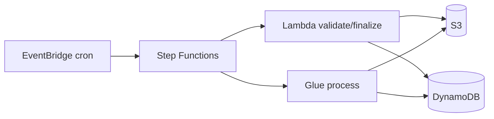

# AWS Automation Base Template

Template genérico para **automações na AWS**: pipelines que combinam S3, Lambda, Glue, DynamoDB, Step Functions e EventBridge.

Use este repositório como base para regressão, ETL, reconciliação, validação de dados, orquestração batch e outros fluxos automatizados.

## Modos de operação

| `workload_type` | Uso |
|-----------------|-----|
| `pipeline` / `automation` | Vários serviços no mesmo stack (cenário principal) |
| `glue` | Apenas AWS Glue (job, crawler, workflow, connection) |
| `lambda` | Apenas Lambda |
| `stepfunctions` | Apenas Step Functions |

## Fluxo padrão (pipeline)



1. **Lambda `validate`** — verifica entrada no S3, grava status inicial no DynamoDB  
2. **Glue Job** — processamento pesado (PySpark), grava saída no S3  
3. **Lambda `finalize`** — compara/valida resultados, persiste conclusão no DynamoDB  

Step Functions orquestra a sequência. EventBridge (opcional) dispara em cron.

## Estrutura

```
infra/
├── main.tf                    # Orquestra todos os módulos
├── modules/
│   ├── s3/buckets/
│   ├── dynamodb/table/
│   ├── glue/                  # job, crawler, workflow, connection
│   ├── lambda/function/
│   ├── stepfunctions/
│   └── eventbridge/schedule/
├── templates/stepfunctions/   # ASL template do pipeline
├── inventories/               # dev, hom, prod
└── examples/                  # glue, lambda, sfn, pipeline

workloads/
├── shared/                    # s3, dynamo, regression (reutilizável)
├── glue/src/                  # Job PySpark
├── aws_lambda/src/            # Handler de automação
└── stepfunctions/definitions/
```

## Início rápido

### 1. Configurar pipeline completo

Edite `infra/inventories/dev/terraform.tfvars`:

```hcl
project_name  = "meu-projeto"
workload_type = "pipeline"
aws_region    = "us-east-1"

enable_s3_buckets = true
enable_dynamodb   = true
enable_lambda     = true
enable_glue_job   = true
enable_stepfunctions = true

glue_job_role_arn = "arn:aws:iam::ACCOUNT:role/..."
lambda_role_arn   = "arn:aws:iam::ACCOUNT:role/..."
sfn_role_arn      = "arn:aws:iam::ACCOUNT:role/..."
```

Referência completa: `infra/examples/pipeline.terraform.tfvars.example`

### 2. Desenvolver automação

| O quê | Onde |
|-------|------|
| Validação / pós-processamento | `workloads/aws_lambda/src/handler.py` |
| Processamento batch | `workloads/glue/src/main.py` |
| Comparação / regressão | `workloads/shared/regression.py` |
| Persistência de resultados | `workloads/shared/dynamo_store.py` |
| Orquestração | `infra/templates/stepfunctions/pipeline.asl.json.tpl` |

### 3. Deploy

```bash
make install
make test
make plan-dev
make apply-dev
```

Antes do apply:
- Suba o script Glue e o zip da Lambda para o bucket `artifacts`
- Configure IAM roles com permissões S3, DynamoDB, Glue e Lambda

## Cenários suportados

| Cenário | Como configurar |
|---------|-----------------|
| Regressão S3 → Lambda → Glue → DynamoDB | `workload_type = "pipeline"` (padrão dev) |
| ETL batch agendado | `enable_eventbridge_schedule = true` |
| Só Lambda consumindo S3 | `workload_type = "lambda"` |
| Só Glue ETL | `workload_type = "glue"` |
| Orquestração customizada | `sfn_definition = file(...)` + `sfn_use_pipeline_template = false` |
| Buckets existentes | `enable_s3_buckets = false` + `s3_source_bucket_name` / `s3_output_bucket_name` |
| Tabela DynamoDB existente | `enable_dynamodb = false` + `dynamodb_table_name` |

## Variáveis de ambiente (auto-injetadas no pipeline)

Lambda recebe automaticamente:

- `SOURCE_BUCKET`, `OUTPUT_BUCKET`, `DYNAMODB_TABLE`
- `PROJECT_NAME`, `ENVIRONMENT`

Glue recebe via argumentos:

- `--SOURCE_BUCKET`, `--OUTPUT_BUCKET`, `--DYNAMODB_TABLE`, `--TempDir`

## IAM (responsabilidade do operador)

O template **referencia** roles existentes. Cada role precisa de permissões mínimas:

| Serviço | Permissões típicas |
|---------|-------------------|
| Lambda | `s3:ListBucket/GetObject`, `dynamodb:PutItem/GetItem` |
| Glue | `s3:*` nos buckets, `dynamodb:PutItem`, logs CloudWatch |
| Step Functions | `lambda:InvokeFunction`, `glue:StartJobRun`, `events:*` |
| EventBridge | `states:StartExecution` na state machine |

## Comandos

```bash
make install      # dependências Python
make test         # pytest
make lint         # flake8
make plan-dev     # terraform plan
make apply-dev    # terraform apply
make destroy-dev  # teardown
```

## CI/CD

`pipeline.yml` — lint, test, plan (dev/hom/prod), apply (prod manual).

## Extensões comuns

- Adicionar **SQS** como trigger da Lambda
- Incluir **API Gateway** para consultar resultados no DynamoDB
- Trocar ASL do Step Functions para fluxos paralelos ou com Choice/Catch
- Empacotar `workloads/shared` como layer da Lambda
