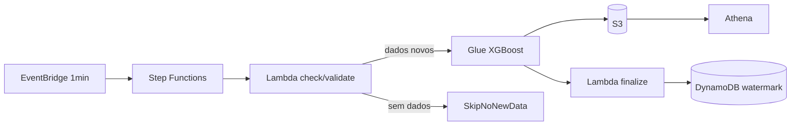

# AWS IA Regressão — Saldo Previsto

Template de automação AWS com pipeline ML **XGBoost** para previsão de saldo bancário. Combina S3, Glue, Lambda, Step Functions, EventBridge, DynamoDB e Athena — com **ingestão incremental a cada 1 minuto** em produção.

## Proposta de valor

Automatizar o **treino, a validação e a publicação** de previsões de saldo bancário, com rastreabilidade operacional e consulta analítica em SQL — sem servidor de aplicação.

| Para quem | Entrega |
|-----------|---------|
| **Engenharia de dados / ML** | Pipeline reprodutível (Glue + Step Functions), retreino a cada **1 min**, métricas e feature importance no S3 |
| **Analytics / negócio** | Tabela Athena com previsão vs. real, erro por cliente, segmento e período |
| **Operações** | Histórico de runs no DynamoDB, orquestração visível no Step Functions |

### Insight principal

> O modelo **não erra igual para todos**. A leitura mais útil não é só o R² global — é o **MAPE por segmento e por mês**, que mostra onde priorizar retreino, regras de negócio ou novas features.

### Onde ver evolução e qualidade

| Fonte | O que mostra | Uso |
|-------|----------------|-----|
| **Athena** `saldo_previsto_db_prod.tb_saldo_previsto_prod` | Predições, erro, `modelo_versao`, `dt_processamento` | Erro por segmento/mês; comparar versões após retreinos |
| **Athena** `saldo_previsto_db_prod.tb_metricas_treino` | RMSE, MAPE, linhas adicionadas por `run_id` / `run_date` | Série temporal de qualidade entre retreinos (1 partição por execução SFN) |
| **S3** `models/xgboost_saldo/metricas.json` | RMSE, MAE, R², MAPE do **último** treino | Snapshot da qualidade atual |
| **S3** `models/xgboost_saldo/champion/` | Modelo XGBoost oficial (`model.ubj`), métricas e histórico de promoções | Versão salva quando **RMSE e MAPE** batem o campeão anterior |
| **S3** `models/xgboost_saldo/feature_importance.json` | Variáveis que mais explicam o saldo | Interpretabilidade e auditoria |
| **DynamoDB** `saldo-previsto-results-prod` | Status das execuções (validate → Glue → finalize) | Monitoramento operacional |

Queries prontas em [`payloads/athena_queries.sql`](payloads/athena_queries.sql).

### Model registry (champion)

A cada retreino o Glue treina do zero e grava métricas. O artefato XGBoost (`.ubj`) **só é persistido** em `models/xgboost_saldo/champion/` quando o run **promove** o campeão:

| Critério | Regra |
|----------|--------|
| Promoção | RMSE **e** MAPE estritamente menores que o champion atual |
| `is_champion = true` | Run que gravou novo `model.ubj` no S3 |
| `run_id` | Nome único da execução Step Functions (1 linha por retreino no Athena) |

```powershell
# Campeão oficial vs último treino
aws s3 cp s3://saldo-previsto-data-prod/models/xgboost_saldo/champion/champion_meta.json -
aws s3 cp s3://saldo-previsto-data-prod/models/xgboost_saldo/metricas.json -
```

### Queries essenciais (Athena)

Database: `saldo_previsto_db_prod`. Result location: `s3://saldo-previsto-data-prod/athena-results/`.

**1. Evolução do treino** — histórico de qualidade (use no dia a dia):

```sql
SELECT dt_processamento,
       run_id,
       ROUND(rmse, 2) AS rmse,
       ROUND(mape, 4) AS mape,
       linhas_adicionadas,
       total_linhas,
       modelo_versao,
       is_champion
FROM saldo_previsto_db_prod.tb_metricas_treino
WHERE run_id NOT IN ('scheduled', 'manual-001')
ORDER BY dt_processamento DESC
LIMIT 30;
```

**2. Tendência suavizada** — média móvel de 5 retreinos (filtra ruído do micro-lote):

```sql
SELECT dt_processamento,
       ROUND(rmse, 2) AS rmse,
       ROUND(mape, 4) AS mape,
       ROUND(AVG(rmse) OVER (ORDER BY dt_processamento ROWS BETWEEN 4 PRECEDING), 2) AS rmse_media_5,
       ROUND(AVG(mape) OVER (ORDER BY dt_processamento ROWS BETWEEN 4 PRECEDING), 4) AS mape_media_5,
       is_champion
FROM saldo_previsto_db_prod.tb_metricas_treino
WHERE run_id NOT IN ('scheduled', 'manual-001')
ORDER BY dt_processamento DESC
LIMIT 30;
```

**3. Campeão atual** — versão oficial salva no S3:

```sql
SELECT dt_processamento, run_id, modelo_versao,
       ROUND(rmse, 2) AS rmse, ROUND(mape, 4) AS mape
FROM saldo_previsto_db_prod.tb_metricas_treino
WHERE is_champion = true
ORDER BY dt_processamento DESC
LIMIT 5;
```

**4. Erro por segmento** — onde o modelo mais precisa melhorar:

```sql
SELECT segmento,
       COUNT(*) AS registros,
       ROUND(AVG(erro_percentual), 2) AS mape_medio,
       ROUND(AVG(erro_absoluto), 2) AS mae_medio
FROM saldo_previsto_db_prod.tb_saldo_previsto_prod
GROUP BY segmento
ORDER BY mape_medio DESC;
```

**5. Comparar versões** — erro nas predições publicadas por `modelo_versao`:

```sql
SELECT modelo_versao,
       MIN(dt_processamento) AS treinado_em,
       COUNT(*) AS registros,
       ROUND(AVG(erro_percentual), 2) AS mape,
       ROUND(AVG(erro_absoluto), 2) AS mae
FROM saldo_previsto_db_prod.tb_saldo_previsto_prod
GROUP BY modelo_versao
ORDER BY treinado_em DESC
LIMIT 10;
```

Com o EventBridge ativo (`rate(1 minute)`), há retreino a cada ~2 min (alternância treino / `SkipNoNewData`). Nem todo minuto gera linha em `tb_metricas_treino` — só quando o Glue treina.

### Ingestão incremental (prod — a cada 1 minuto)

Configuração atual em `infra/inventories/prod/terraform.tfvars`:

```hcl
eventbridge_schedule_expression = "rate(1 minute)"
ml_ingest_mode                  = "micro"
ml_incremental_step_minutes     = 1
ml_ingest_daily_simulated       = true
ml_enable_check_new_data        = true
```

Fluxo:

1. **EventBridge** dispara o Step Functions a cada **1 minuto**
2. **Step Functions** atribui `run_id` = nome único da execução (`$$.Execution.Name`)
3. **Lambda `check_new_data`** verifica:
   - CSVs novos em `s3://saldo-previsto-data-prod/incoming/` (ETag vs watermark DynamoDB)
   - Se passou o intervalo de **1 min** desde o último lote simulado
4. Se **não há dados novos**, encerra sem treinar (`SkipNoNewData`)
5. Se há dados, o **Glue** faz append de um **micro-lote** (+1 min na última `data_referencia`, ~2 clientes novos por lote) e/ou merge de CSVs em `incoming/`
6. Retreina com split **temporal**, grava métricas em `tb_metricas_treino` (1 partição por `run_id`) e promove champion se RMSE **e** MAPE melhorarem
7. **Glue `MaxConcurrentRuns = 1`** evita execuções sobrepostas; SFN encerra em `SkipGlueBusy` se o job anterior ainda estiver rodando

Enviar CSV externo:

```powershell
aws s3 cp meu_lote.csv s3://saldo-previsto-data-prod/incoming/meu_lote.csv
```

O próximo ciclo (≤1 min) detecta o arquivo, treina e marca o ETag no DynamoDB (`__ingest_watermark__`).

Teste manual da ingestão (sem treinar):

```powershell
python scripts/run_incremental_daily.py --run-id teste-micro-1
```

<details>
<summary>Modo diário (legacy — não usado em prod)</summary>

Para retreino **uma vez por dia** em vez de micro-lotes, altere no tfvars:

```hcl
eventbridge_schedule_expression = "cron(0 6 * * ? *)"   # 06:00 UTC
ml_ingest_mode                  = "daily"
```

Nesse modo o Glue adiciona **+1 dia** e **10 clientes novos** por execução.

</details>


**[Guia completo de instalação e testes → docs/GUIA_INSTALACAO.md](docs/GUIA_INSTALACAO.md)**

Inclui arquitetura, pré-requisitos, deploy passo a passo, testes (local, Glue, Step Functions, Athena) e troubleshooting.

## Início rápido

```powershell
# 1. Dependências e testes
pip install -r requirements.txt
pytest tests/ -v

# 2. Assets no S3 (obrigatório após mudanças no código)
.\scripts\upload_glue_assets.ps1 -Bucket saldo-previsto-data-prod
.\scripts\package_lambda.ps1 -Bucket saldo-previsto-data-prod -Upload
aws lambda update-function-code `
  --function-name saldo-previsto-lambda-prod `
  --s3-bucket saldo-previsto-data-prod `
  --s3-key builds/handler.zip `
  --region us-east-1

# 3. Infraestrutura
cd infra
terraform init
terraform apply "-var-file=inventories/prod/terraform.tfvars"

# 4. Disparar pipeline
aws stepfunctions start-execution `
  --state-machine-arn arn:aws:states:us-east-1:303238378103:stateMachine:saldo-previsto-sfn-prod `
  --input file://../payloads/sfn_input.json
```

## Arquitetura



## Desligar o pipeline

Para **parar treinos automáticos** sem apagar modelo, predições ou tabelas Athena:

**Imediato (CLI):**

```powershell
aws events disable-rule --name saldo-previsto-schedule-prod --region us-east-1
```

**Permanente (Terraform)** — em `infra/inventories/prod/terraform.tfvars`:

```hcl
enable_eventbridge_schedule = false
```

```powershell
cd infra
terraform apply "-var-file=inventories/prod/terraform.tfvars"
```

Para **parar só a ingestão simulada** (pipeline só treina com CSV em `incoming/`):

```hcl
ml_ingest_daily_simulated = false
```

Nesse caso o EventBridge continua disparando a cada 1 min, mas encerra em `SkipNoNewData` até chegar arquivo em `incoming/`.

Para **religar**:

```powershell
aws events enable-rule --name saldo-previsto-schedule-prod --region us-east-1
```

O modelo em `models/xgboost_saldo/` (incluindo `champion/`) e as tabelas Athena continuam consultáveis com o agendamento desligado.

## Modos de operação

| `workload_type` | Uso |
|-----------------|-----|
| `pipeline` | Fluxo completo (SFN + Lambda + Glue) — **prod atual** |
| `glue` | Apenas Glue Job |
| `lambda` | Apenas Lambda |
| `stepfunctions` | Apenas Step Functions |

## Estrutura principal

```
app/src/           # ML local
glue_bundle/       # Código deployado no Glue
workloads/         # Lambda + libs compartilhadas
infra/             # Terraform (modules + inventories)
scripts/           # Deploy e utilitários
payloads/          # Inputs SFN e SQL Athena
docs/              # Documentação
```

## Comandos

| Comando | Ação |
|---------|------|
| `make install` | Instala dependências |
| `make test` | Roda pytest |
| `make plan-prod` | Terraform plan (prod) |
| `make apply-prod` | Terraform apply (prod) |
| `make generate-data` | Gera dataset sintético local |

## Recursos prod (referência)

| Serviço | Nome |
|---------|------|
| S3 | `saldo-previsto-data-prod` |
| Glue Job | `saldo-previsto-glue-job-prod` |
| Step Functions | `saldo-previsto-sfn-prod` |
| Athena DB | `saldo_previsto_db_prod` |
| Athena Table (predições) | `tb_saldo_previsto_prod` |
| Athena Table (métricas) | `tb_metricas_treino` |
| EventBridge | `saldo-previsto-schedule-prod` (`rate(1 minute)`) |
| Champion (S3) | `models/xgboost_saldo/champion/model.ubj` |

Consulta rápida (predições):

```sql
SELECT cliente_id, saldo_previsto, saldo_real, erro_percentual, modelo_versao
FROM saldo_previsto_db_prod.tb_saldo_previsto_prod
LIMIT 10;
```

## Licença / uso

Template base para novos projetos de automação e ML na AWS. Copie o repositório, ajuste `infra/inventories/<env>/terraform.tfvars` e substitua ARNs da conta.
