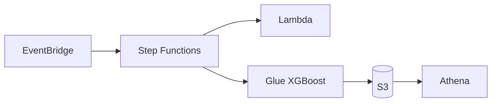

# AWS IA Regressão — Saldo Previsto

Template de automação AWS com pipeline ML **XGBoost** para previsão de saldo bancário. Combina S3, Glue, Lambda, Step Functions, EventBridge, DynamoDB e Athena.

## Proposta de valor

Automatizar o **treino, a validação e a publicação** de previsões de saldo bancário, com rastreabilidade operacional e consulta analítica em SQL — sem servidor de aplicação.

| Para quem | Entrega |
|-----------|---------|
| **Engenharia de dados / ML** | Pipeline reprodutível (Glue + Step Functions), retreino agendado, métricas e feature importance no S3 |
| **Analytics / negócio** | Tabela Athena com previsão vs. real, erro por cliente, segmento e período |
| **Operações** | Histórico de runs no DynamoDB, orquestração visível no Step Functions |

### Insight principal

> O modelo **não erra igual para todos**. A leitura mais útil não é só o R² global — é o **MAPE por segmento e por mês**, que mostra onde priorizar retreino, regras de negócio ou novas features.

### Onde ver evolução e qualidade

| Fonte | O que mostra | Uso |
|-------|----------------|-----|
| **Athena** `saldo_previsto_db_prod.tb_saldo_previsto_prod` | Predições, erro, `modelo_versao`, `dt_processamento` | Erro por segmento/mês; comparar versões após retreinos |
| **S3** `models/xgboost_saldo/metricas.json` | RMSE, MAE, R², MAPE do **último** treino | Snapshot da qualidade atual |
| **S3** `models/xgboost_saldo/feature_importance.json` | Variáveis que mais explicam o saldo | Interpretabilidade e auditoria |
| **DynamoDB** `saldo-previsto-results-prod` | Status das execuções (validate → Glue → finalize) | Monitoramento operacional |

Queries prontas em [`payloads/athena_queries.sql`](payloads/athena_queries.sql).

**Erro por segmento (onde o modelo mais precisa melhorar):**

```sql
SELECT segmento,
       COUNT(*) AS registros,
       ROUND(AVG(erro_percentual), 2) AS mape_medio,
       ROUND(AVG(erro_absoluto), 2) AS mae_medio
FROM saldo_previsto_db_prod.tb_saldo_previsto_prod
GROUP BY segmento
ORDER BY mape_medio DESC;
```

**Evolução entre retreinos (compare `modelo_versao`):**

```sql
SELECT modelo_versao,
       MIN(dt_processamento) AS treinado_em,
       ROUND(AVG(erro_percentual), 2) AS mape
FROM saldo_previsto_db_prod.tb_saldo_previsto_prod
GROUP BY modelo_versao
ORDER BY treinado_em;
```

**Últimas métricas globais (CLI):**

```powershell
aws s3 cp s3://saldo-previsto-data-prod/models/xgboost_saldo/metricas.json -
```

Com o EventBridge ativo, cada execução gera nova `modelo_versao` — as queries acima passam a formar a **série temporal de qualidade do modelo**.


**[Guia completo de instalação e testes → docs/GUIA_INSTALACAO.md](docs/GUIA_INSTALACAO.md)**

Inclui arquitetura, pré-requisitos, deploy passo a passo, testes (local, Glue, Step Functions, Athena) e troubleshooting.

## Início rápido

```powershell
# 1. Dependências e testes
pip install -r requirements.txt
pytest tests/ -v

# 2. Assets no S3
.\scripts\upload_glue_assets.ps1 -Bucket saldo-previsto-data-prod
.\scripts\package_lambda.ps1 -Bucket saldo-previsto-data-prod -Upload

# 3. Infraestrutura
cd infra
terraform init
terraform apply "-var-file=inventories/prod/terraform.tfvars"

# 4. Disparar pipeline
aws stepfunctions start-execution `
  --state-machine-arn arn:aws:states:us-east-1:303238378103:stateMachine:saldo-previsto-sfn-prod `
  --input file://../payloads/sfn_input.json
```

## Arquitetura



## Modos de operação

| `workload_type` | Uso |
|-----------------|-----|
| `pipeline` | Fluxo completo (SFN + Lambda + Glue) — **prod atual** |
| `glue` | Apenas Glue Job |
| `lambda` | Apenas Lambda |
| `stepfunctions` | Apenas Step Functions |

## Estrutura principal

```
app/src/           # ML local
glue_bundle/       # Código deployado no Glue
workloads/         # Lambda + libs compartilhadas
infra/             # Terraform (modules + inventories)
scripts/           # Deploy e utilitários
payloads/          # Inputs SFN e SQL Athena
docs/              # Documentação
```

## Comandos

| Comando | Ação |
|---------|------|
| `make install` | Instala dependências |
| `make test` | Roda pytest |
| `make plan-prod` | Terraform plan (prod) |
| `make apply-prod` | Terraform apply (prod) |
| `make generate-data` | Gera dataset sintético local |

## Recursos prod (referência)

| Serviço | Nome |
|---------|------|
| S3 | `saldo-previsto-data-prod` |
| Glue Job | `saldo-previsto-glue-job-prod` |
| Step Functions | `saldo-previsto-sfn-prod` |
| Athena DB | `saldo_previsto_db_prod` |
| Athena Table | `tb_saldo_previsto_prod` |

Consulta Athena:

```sql
SELECT * FROM saldo_previsto_db_prod.tb_saldo_previsto_prod LIMIT 10;
```

## Licença / uso

Template base para novos projetos de automação e ML na AWS. Copie o repositório, ajuste `infra/inventories/<env>/terraform.tfvars` e substitua ARNs da conta.
