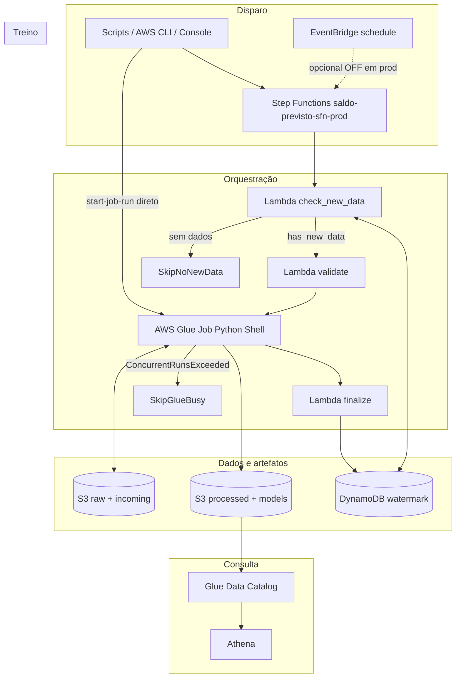
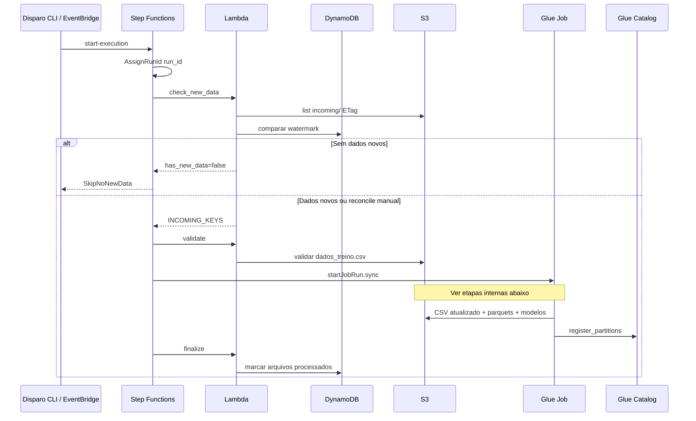
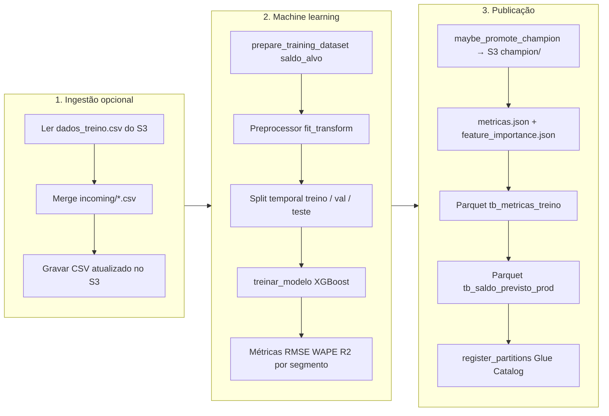
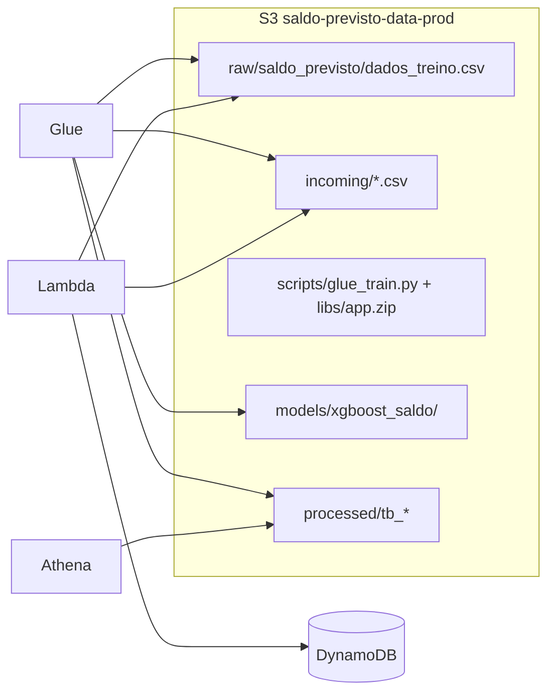
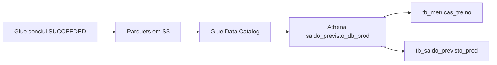

# Fluxo de treinamento e serviços AWS

Diagrama do **retreino XGBoost** em produção: orquestração, treino no Glue e artefatos no S3. Estado atual: EventBridge **desligado** — disparo via scripts ou CLI (ver [`infra/inventories/prod/terraform.tfvars`](../infra/inventories/prod/terraform.tfvars)).

---

## Serviços AWS utilizados

| Serviço | Recurso (prod) | Papel no treinamento |
|---------|----------------|----------------------|
| **Amazon S3** | `saldo-previsto-data-prod` | CSV de treino (`raw/`), lotes `incoming/`, script Glue (`scripts/`), libs (`libs/app.zip`), modelos (`models/xgboost_saldo/`), parquets (`processed/`), resultados Athena (`athena-results/`) |
| **AWS Glue** | `saldo-previsto-glue-job-prod` | Job Python Shell: ingestão opcional, preprocessamento, treino XGBoost, métricas, predições, registro de partições |
| **AWS Lambda** | `saldo-previsto-lambda-prod` | `check_new_data`, `validate`, `finalize` (watermark no DynamoDB) |
| **Step Functions** | `saldo-previsto-sfn-prod` | Orquestra Lambda → Glue (sync) → Lambda |
| **Amazon EventBridge** | `saldo-previsto-schedule-prod` | Agenda opcional (`rate(2 minutes)` no tfvars; **OFF** em prod) |
| **Amazon DynamoDB** | `saldo-previsto-results-prod` | Watermark de arquivos `incoming/` e status do run |
| **AWS Glue Data Catalog** | DB `saldo_previsto_db_prod` | Tabelas `tb_metricas_treino`, `tb_saldo_previsto_prod` |
| **Amazon Athena** | Workgroup padrão + DB acima | Consulta SQL às métricas e predições |
| **AWS IAM** | Roles Glue / Lambda / SFN | Permissões S3, Glue, DynamoDB, logs |

---

## Arquitetura (treinamento)

---

## Sequência: Step Functions → treino

**Disparo alternativo (sem SFN):** `aws glue start-job-run` ou `run_rafo044_experiment.py --reconcile` chama o Glue direto com `--INGEST_DAILY=false` e `--INCOMING_KEYS=[]`.

---

## Etapas internas do Glue (treino XGBoost)

| Etapa | Saída principal |
|-------|-----------------|
| Ingestão | `s3://.../raw/saldo_previsto/dados_treino.csv` |
| Treino | `models/xgboost_saldo/metricas.json`, `history/{run_id}.json` |
| Champion | `models/xgboost_saldo/champion/model.ubj` (se RMSE ≥ 2% melhor) |
| Métricas run | `processed/tb_metricas_treino/run_date=.../run_id=.../` |
| Predições teste | `processed/tb_saldo_previsto_prod/ano=/mes=/segmento=/` |

---

## Onde cada serviço grava/lê

---

## Consulta pós-treino

Queries: [`payloads/athena_queries.sql`](../payloads/athena_queries.sql) · Guia: [`ANALISE_METRICAS_ATHENA.md`](ANALISE_METRICAS_ATHENA.md)

---

## Referências

- Casos de uso e escala em produção real: [`USO_REAL_E_ESCALABILIDADE.md`](USO_REAL_E_ESCALABILIDADE.md)
- ASL do pipeline: [`infra/templates/stepfunctions/pipeline-ml.asl.json.tpl`](../infra/templates/stepfunctions/pipeline-ml.asl.json.tpl)
- Código do treino: [`glue_bundle/train_pipeline.py`](../glue_bundle/train_pipeline.py)
- Experimento local: [`scripts/run_rafo044_experiment.py`](../scripts/run_rafo044_experiment.py)
