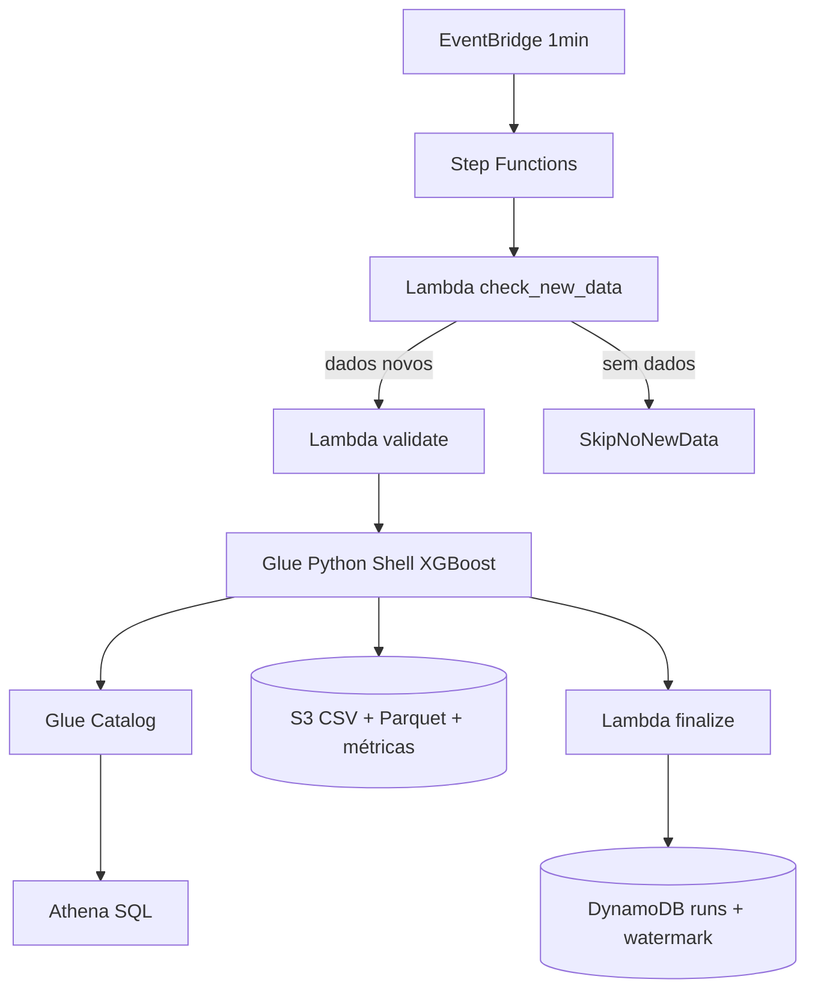

# Guia de instalação e testes — Saldo Previsto (ML + AWS)

Documentação do projeto **aws-ia-regressao**: template de automação AWS com pipeline ML XGBoost para previsão de saldo bancário.

---

## Sumário

1. [Visão geral](#1-visão-geral)
2. [Pré-requisitos](#2-pré-requisitos)
3. [Instalação local](#3-instalação-local)
4. [Configuração AWS (antes do deploy)](#4-configuração-aws-antes-do-deploy)
5. [Deploy passo a passo](#5-deploy-passo-a-passo)
6. [Testes](#6-testes)
7. [Consulta no Athena](#7-consulta-no-athena)
8. [Agendamento (EventBridge)](#8-agendamento-eventbridge)
9. [Scripts úteis](#9-scripts-úteis)
10. [Solução de problemas](#10-solução-de-problemas)
11. [Estrutura do repositório](#11-estrutura-do-repositório)

---

## 1. Visão geral

### O que o projeto faz

- Gera dataset sintético de saldo bancário (50k linhas)
- Treina modelo **XGBoost** com feature engineering
- Grava métricas, feature importance e predições no **S3**
- Registra tabela no **Glue Data Catalog** para consulta no **Athena**
- Orquestra o fluxo com **Step Functions** (check → validate → Glue → finalize)
- **Ingesta dados simulados a cada 1 minuto** (micro-lotes) e detecta CSVs em `incoming/`
- Agenda retreino com **EventBridge** (`rate(1 minute)` em prod)
- Persiste histórico de execuções no **DynamoDB** e métricas por run no **Athena** (`tb_metricas_treino`)

### Arquitetura (prod)



### Recursos AWS (ambiente prod atual)

| Recurso | Nome |
|---------|------|
| S3 | `saldo-previsto-data-prod` |
| Glue Job | `saldo-previsto-glue-job-prod` |
| Step Functions | `saldo-previsto-sfn-prod` |
| Lambda | `saldo-previsto-lambda-prod` |
| DynamoDB | `saldo-previsto-results-prod` |
| Glue Database | `saldo_previsto_db_prod` |
| Glue/Athena Table (predições) | `tb_saldo_previsto_prod` |
| Glue/Athena Table (métricas) | `tb_metricas_treino` |
| EventBridge Rule | `saldo-previsto-schedule-prod` (`rate(1 minute)`) |

---

## 2. Pré-requisitos

### Software local

| Ferramenta | Versão mínima | Uso |
|------------|---------------|-----|
| Python | 3.10+ | ML, testes, scripts |
| pip | — | Dependências |
| Terraform | 1.5+ | Infraestrutura |
| AWS CLI v2 | — | Deploy assets, testes |
| PowerShell | 5.1+ (Windows) | Scripts `.ps1` |
| Git | — | Clone do repositório |

### Credenciais AWS

Configure o profile ou variáveis de ambiente com permissão para S3, Glue, Lambda, Step Functions, DynamoDB, IAM (conforme seu papel):

```powershell
aws configure
# ou
$env:AWS_PROFILE = "seu-profile"
aws sts get-caller-identity
```

### Conta de referência

Exemplos usam conta `303238378103` e região `us-east-1`. Substitua pelos valores da sua conta ao replicar.

---

## 3. Instalação local

### 3.1 Clone e dependências

```powershell
cd C:\caminho\para\aws-ia-regressao

python -m venv .venv
.\.venv\Scripts\Activate.ps1

pip install -r requirements.txt
```

### 3.2 Testes unitários (sem AWS)

```powershell
pytest tests/ -v
# ou
make test
```

Esperado: **11 testes passando** (preprocessor, model, lambda handler, regression).

### 3.3 Lint (opcional)

```powershell
make lint
```

---

## 4. Configuração AWS (antes do deploy)

### 4.1 Bucket S3

Crie o bucket (se ainda não existir):

```powershell
aws s3 mb s3://saldo-previsto-data-prod --region us-east-1
```

Pastas usadas pelo pipeline:

```
saldo-previsto-data-prod/
├── raw/saldo_previsto/dados_treino.csv   # entrada
├── scripts/glue_train.py                 # entrypoint Glue
├── libs/app.zip                          # bundle ML
├── builds/handler.zip                    # Lambda
├── models/xgboost_saldo/                 # métricas JSON
├── processed/tb_saldo_previsto_prod/     # Parquet (Athena)
├── temp/                                 # Glue temp
└── athena-results/                       # resultados queries Athena
```

### 4.2 IAM Roles

O Terraform **referencia** roles existentes; não as cria. Para prod, são necessárias três roles:

| Role | Trust principal | Uso |
|------|-----------------|-----|
| `saldo-previsto-glue-role-prod` | `glue.amazonaws.com` | Job Glue |
| `saldo-previsto-lambda-role-prod` | `lambda.amazonaws.com` | Lambda validate/finalize |
| `saldo-previsto-sfn-role-prod` | `states.amazonaws.com`, `events.amazonaws.com` | Step Functions + EventBridge |

Policies de exemplo em `scripts/iam/`:

```powershell
# SFN + Lambda (primeira vez)
.\scripts\setup_pipeline_iam.ps1

# Glue → Glue Catalog (partições Athena)
aws iam put-role-policy `
  --role-name saldo-previsto-glue-role-prod `
  --policy-name glue-catalog-inline `
  --policy-document file://scripts/iam/glue-catalog-policy.json
```

Glue role também precisa de acesso S3 ao bucket e `AWSGlueServiceRole`.

### 4.3 Usuário Terraform / EventBridge

Se `terraform apply` falhar com `events:TagResource`, anexe ao usuário IAM a policy em:

`scripts/iam/terraform-user-eventbridge-policy.json`

---

## 5. Deploy passo a passo

### Passo 1 — Gerar e enviar dataset

```powershell
# Local (opcional)
python scripts/run_generate_dataset.py --local-only --clientes 5000 --meses 10

# Upload para S3
python scripts/run_generate_dataset.py `
  --clientes 5000 --meses 10 `
  --bucket saldo-previsto-data-prod `
  --key raw/saldo_previsto/dados_treino.csv
```

### Passo 2 — Empacotar e enviar assets Glue

```powershell
.\scripts\upload_glue_assets.ps1 -Bucket saldo-previsto-data-prod
```

Envia `libs/app.zip` e `scripts/glue_train.py`.

### Passo 3 — Empacotar e enviar Lambda

```powershell
.\scripts\package_lambda.ps1 -Bucket saldo-previsto-data-prod -Upload
```

### Passo 4 — Configurar Terraform

Edite `infra/inventories/prod/terraform.tfvars` (ou copie de `infra/examples/`).

Variáveis principais:

```hcl
project_name             = "saldo-previsto"
workload_type            = "pipeline"
enable_glue_job          = true
enable_lambda            = true
enable_stepfunctions     = true
enable_dynamodb          = true
enable_glue_data_catalog = true
enable_eventbridge_schedule = true
```

### Passo 5 — Terraform apply

**PowerShell:** sempre coloque o `-var-file` entre aspas.

```powershell
cd infra
terraform init
terraform plan "-var-file=inventories/prod/terraform.tfvars"
terraform apply "-var-file=inventories/prod/terraform.tfvars"
```

### Passo 6 — Registrar partições existentes (bootstrap Athena)

Se já houver Parquet no S3 antes do catálogo:

```powershell
cd ..
python scripts/register_catalog_partitions.py
```

### Passo 7 — Configurar Athena

No console **Athena → Settings → Query result location**:

```
s3://saldo-previsto-data-prod/athena-results/
```

---

## 6. Testes

### 6.1 Teste local — ML (opcional)

Requer CSV no S3 ou ajuste de buckets:

```powershell
make train-local
```

### 6.2 Teste — Glue Job isolado

```powershell
aws glue start-job-run --job-name saldo-previsto-glue-job-prod
```

Acompanhar:

```powershell
aws glue get-job-runs --job-name saldo-previsto-glue-job-prod --max-results 3
```

Saídas esperadas:

- `s3://saldo-previsto-data-prod/models/xgboost_saldo/metricas.json`
- `s3://saldo-previsto-data-prod/processed/tb_saldo_previsto_prod/...`

### 6.3 Teste — Pipeline completo (Step Functions)

**Importante no PowerShell:** use arquivo JSON, não string inline.

```powershell
aws stepfunctions start-execution `
  --state-machine-arn arn:aws:states:us-east-1:303238378103:stateMachine:saldo-previsto-sfn-prod `
  --input file://../payloads/sfn_input.json
```

Payload em `payloads/sfn_input.json`:

```json
{"run_id":"manual-001","source_prefix":"raw/saldo_previsto/"}
```

Verificar status:

```powershell
aws stepfunctions list-executions `
  --state-machine-arn arn:aws:states:us-east-1:303238378103:stateMachine:saldo-previsto-sfn-prod `
  --max-results 5
```

Fluxo esperado: **CheckNewData → HasNewData → ValidateInput → RunGlueJob → FinalizeRun → SUCCEEDED**

Se não houver CSV em `incoming/` e o intervalo de 1 min ainda não passou: **CheckNewData → SkipNoNewData → SUCCEEDED** (sem treino).

### 6.4 Teste — DynamoDB (histórico de runs)

```powershell
aws dynamodb scan --table-name saldo-previsto-results-prod --max-items 5
```

### 6.5 Teste — EventBridge

```powershell
aws events describe-rule --name saldo-previsto-schedule-prod
aws events list-targets-by-rule --rule saldo-previsto-schedule-prod
```

Estado esperado: `"State": "ENABLED"`, `"ScheduleExpression": "rate(1 minute)"`, target = Step Functions.

### 6.6 Checklist de validação

| # | Verificação | Comando / local |
|---|-------------|-----------------|
| 1 | Testes unitários OK | `pytest tests/ -v` |
| 2 | CSV no S3 | `aws s3 ls s3://saldo-previsto-data-prod/raw/saldo_previsto/` |
| 3 | Glue job SUCCEEDED | Console Glue ou `get-job-runs` |
| 4 | Métricas geradas | `aws s3 cp s3://.../metricas.json -` |
| 5 | SFN SUCCEEDED | Console Step Functions |
| 6 | Partições no catálogo | `aws glue get-partitions --database-name saldo_previsto_db_prod --table-name tb_saldo_previsto_prod --query length(Partitions)` |
| 7 | Query Athena retorna linhas | Ver seção 7 |
| 8 | Métricas por run (1 min) | Query em `tb_metricas_treino` (seção 7) |

---

## 7. Consulta no Athena

### Database correto

Use **`saldo_previsto_db_prod`**, não outro database do workspace (ex.: `mlops_iris_dev_analytics`).

No dropdown do Query editor, selecione `saldo_previsto_db_prod`, ou qualifique na query:

```sql
SELECT ano, mes, segmento, COUNT(*) AS registros
FROM saldo_previsto_db_prod.tb_saldo_previsto_prod
GROUP BY ano, mes, segmento
ORDER BY ano, mes, segmento;
```

Mais queries em `payloads/athena_queries.sql`.

### Colunas da tabela de resultados

| Coluna | Descrição |
|--------|-----------|
| `cliente_id` | ID do cliente |
| `saldo_previsto` | Valor previsto pelo modelo |
| `saldo_real` | Valor real (holdout) |
| `erro_absoluto` | \|real − previsto\| |
| `erro_percentual` | Erro em % |
| `modelo_versao` | Versão do modelo |
| `ano`, `mes`, `segmento` | Partições |

### Tabela de métricas (`tb_metricas_treino`)

Histórico de cada retreino (um registro por execução com ingestão). Partições: `run_date`, `run_id`.

| Coluna | Descrição |
|--------|-----------|
| `rmse`, `mae`, `r2`, `mape` | Métricas do holdout |
| `total_linhas` | Tamanho do dataset após ingestão |
| `linhas_adicionadas` | Linhas do micro-lote simulado |
| `data_referencia_lote` | Timestamp do lote ingerido |
| `modelo_versao` | Hash da versão do modelo |
| `dt_processamento` | ISO8601 do treino |

```sql
SELECT run_date, run_id, linhas_adicionadas,
       ROUND(rmse, 2) AS rmse, ROUND(mape, 4) AS mape, modelo_versao
FROM saldo_previsto_db_prod.tb_metricas_treino
ORDER BY dt_processamento DESC
LIMIT 20;
```

---

## 8. Agendamento e ingestão (EventBridge)

### Configuração atual em prod (micro — 1 minuto)

O pipeline em produção **não usa ingestão diária**. A cada **1 minuto** o EventBridge dispara o Step Functions; se houver lote simulado pendente ou CSV em `incoming/`, o Glue ingere um micro-lote (+1 min na última data) e retreina.

```hcl
enable_eventbridge_schedule     = true
eventbridge_schedule_expression = "rate(1 minute)"
ml_ingest_daily_simulated       = true
ml_ingest_mode                  = "micro"
ml_incremental_step_minutes     = 1
ml_enable_check_new_data        = true
glue_max_concurrent_runs        = 1
```

Fluxo Step Functions (`pipeline-ml.asl.json.tpl`):

1. Lambda `check_new_data` — arquivos novos em `incoming/` **ou** lote simulado com ≥1 min desde o último
2. Se não houver dados → encerra (`SkipNoNewData`)
3. Se houver → valida → Glue (passa `--INCOMING_KEYS`) → finaliza (atualiza watermark)

CSV externo:

```powershell
aws s3 cp lote.csv s3://saldo-previsto-data-prod/incoming/lote.csv
```

Input enviado ao Step Functions pelo EventBridge:

```json
{"run_id":"scheduled","source_prefix":"raw/"}
```

### Alternativa: ingestão diária (legacy)

Para retreino **uma vez por dia** com lote diário (+1 dia, 10 clientes novos):

```hcl
eventbridge_schedule_expression = "cron(0 6 * * ? *)"   # 06:00 UTC = 03:00 BRT
ml_ingest_mode                  = "daily"
ml_enable_check_new_data        = false
```

Para **06:00 horário de Brasília**:

```hcl
eventbridge_schedule_expression = "cron(0 9 * * ? *)"   # 09:00 UTC
ml_ingest_mode                  = "daily"
```

---

## 9. Scripts úteis

| Script | Descrição |
|--------|-----------|
| `scripts/generate_dataset.py` | Gera CSV sintético |
| `scripts/run_generate_dataset.py` | CLI upload local/S3 |
| `scripts/upload_glue_assets.ps1` | Zip + upload bundle Glue |
| `scripts/package_lambda.ps1 -Upload` | Zip + upload Lambda |
| `scripts/setup_pipeline_iam.ps1` | Cria roles SFN + Lambda |
| `scripts/register_catalog_partitions.py` | Bootstrap partições Athena |
| `scripts/run_incremental_daily.py` | Teste manual de ingestão simulada (local/S3) |
| `infra/terraform-dev.ps1` | Helper Terraform dev |

### Makefile

```powershell
make install        # pip install
make test           # pytest
make plan-prod      # terraform plan prod
make apply-prod     # terraform apply prod (auto-approve)
make generate-data  # dataset local
```

---

## 10. Solução de problemas

| Erro | Causa | Solução |
|------|-------|---------|
| `State Machine Does Not Exist` | SFN não aplicada | `terraform apply` com `enable_stepfunctions = true` |
| `bucket does not exist` | S3 não criado | `aws s3 mb ...` ou `enable_s3_buckets = true` |
| `ModuleNotFoundError` no Glue | Bundle desatualizado | `upload_glue_assets.ps1` |
| `Float types are not supported` (Lambda) | DynamoDB | Já corrigido em `dynamo_store.py`; reempacote Lambda |
| `TABLE_NOT_FOUND` no Athena | Database errado | Use `saldo_previsto_db_prod.tb_saldo_previsto_prod` |
| `events:TagResource` denied | IAM usuário | Policy em `scripts/iam/terraform-user-eventbridge-policy.json` |
| JSON inline no PowerShell falha | Parsing PS | Use `--input file://caminho/arquivo.json` |
| `HIVE_INVALID_METADATA` duplicate columns | `run_id` duplicado (coluna + partição) | Já corrigido em `catalog-metrics`; `terraform apply` |
| SFN `unknown action: check_new_data` | Lambda desatualizada | `package_lambda.ps1 -Upload` + `update-function-code` |
| Terraform `.tfvars` error | PowerShell | `"-var-file=inventories/prod/terraform.tfvars"` entre aspas |

---

## 11. Estrutura do repositório

```
aws-ia-regressao/
├── app/src/                  # Código ML (desenvolvimento local)
├── glue_bundle/              # Bundle flat deployado no Glue
├── workloads/
│   ├── aws_lambda/src/       # Handler Lambda pipeline
│   └── shared/               # DynamoDB, S3, regression
├── infra/
│   ├── main.tf               # Orquestra módulos
│   ├── modules/              # S3, Glue, Lambda, SFN, EventBridge, Catalog
│   ├── inventories/          # dev, hom, prod tfvars
│   └── examples/             # Exemplos de configuração
├── scripts/                  # Deploy, dataset, IAM
├── payloads/                 # JSON Step Functions, SQL Athena
├── tests/                    # pytest
└── docs/
    └── GUIA_INSTALACAO.md    # Este arquivo
```

### Onde alterar cada parte

| Objetivo | Arquivo |
|----------|---------|
| Feature engineering / ML | `app/src/preprocessor.py`, `glue_bundle/preprocessor.py` |
| Modelo XGBoost | `app/src/model.py`, `glue_bundle/model.py` |
| Pipeline Glue | `glue_bundle/train_pipeline.py` |
| Validação / finalize | `workloads/aws_lambda/src/handler.py` |
| Orquestração | `infra/templates/stepfunctions/pipeline.asl.json.tpl` |
| Infra prod | `infra/inventories/prod/terraform.tfvars` |
| Tabela Athena | `infra/modules/glue/catalog-table/` |

---

## Referências rápidas

- Exemplo ML tfvars: `infra/examples/ml-saldo-previsto.terraform.tfvars.example`
- Exemplo pipeline: `infra/examples/pipeline.terraform.tfvars.example`
- CI/CD: `pipeline.yml`
- Conta/região prod: `303238378103` / `us-east-1`
