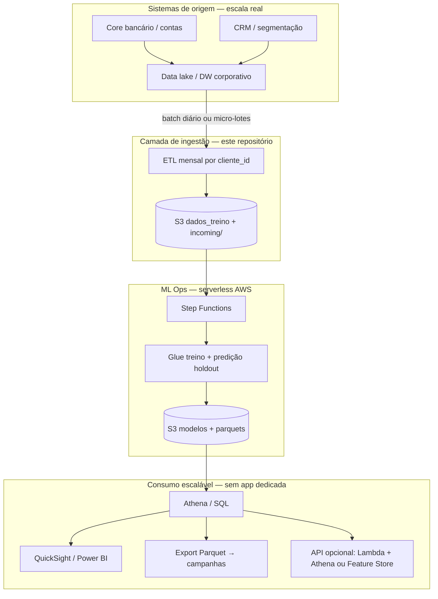
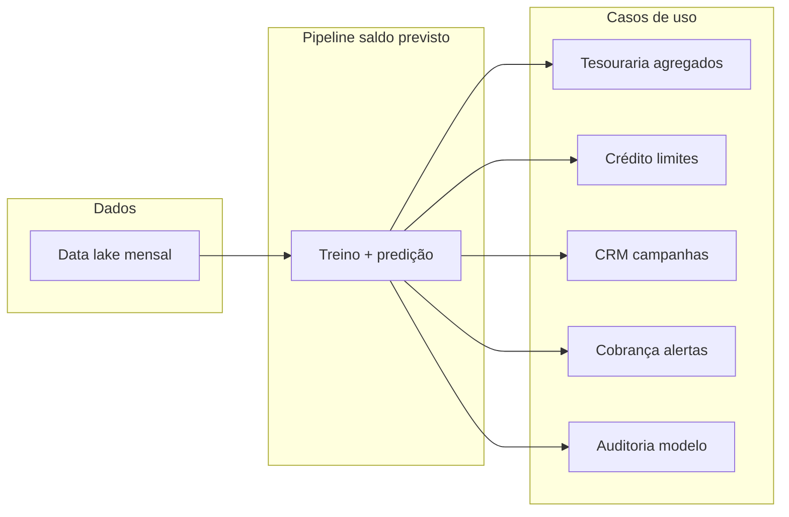
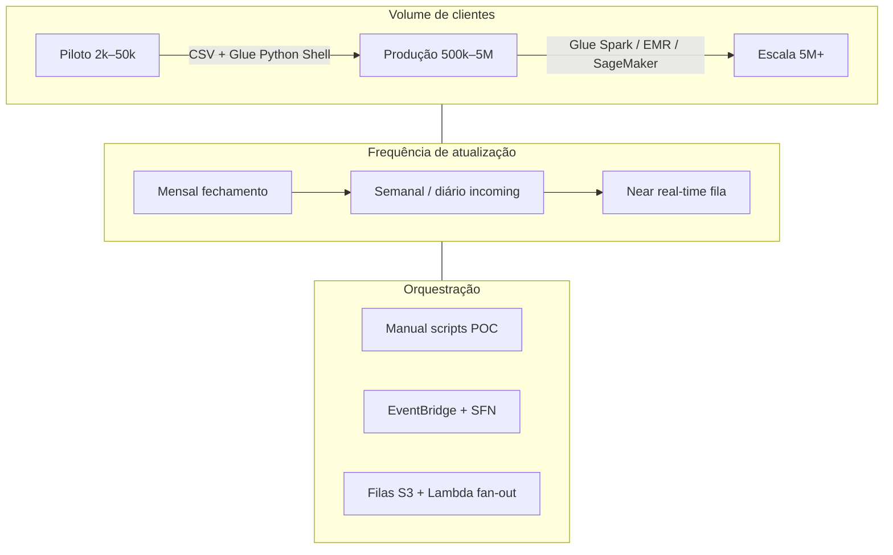
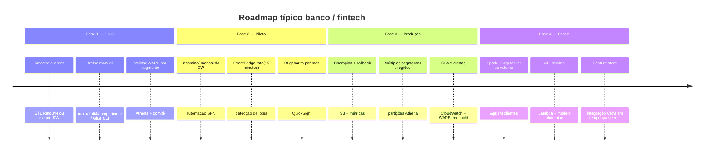
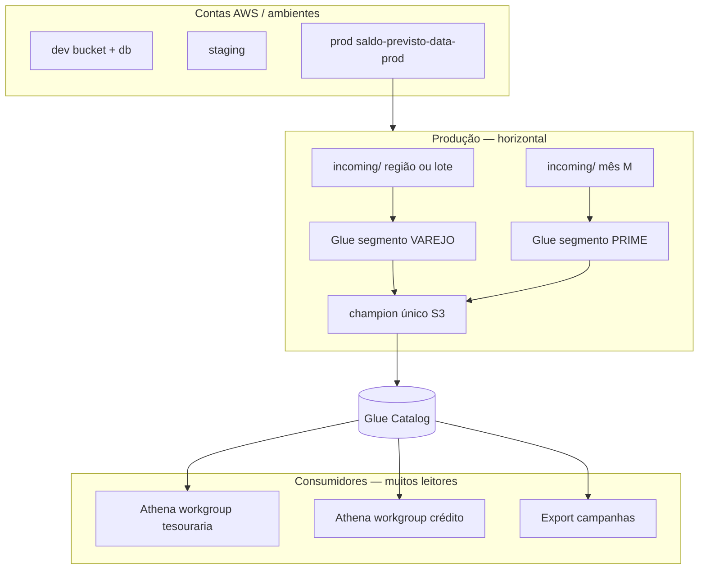
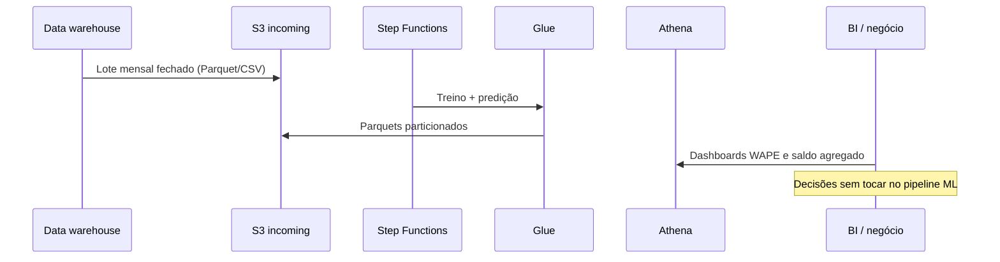

# Uso em produção real e escalabilidade

Como o pipeline de **previsão de saldo** (XGBoost + AWS) se encaixa em um banco ou fintech de verdade: casos de uso, integrações e caminho de escala — do piloto com milhares de clientes a milhões de contas.

Documentação técnica do treino: [`FLUXO_TREINAMENTO_AWS.md`](FLUXO_TREINAMENTO_AWS.md) · Modelo de dados: [`DATA_MODEL.md`](DATA_MODEL.md)

---

## O que o modelo entrega na prática

Para cada **cliente** e **mês de referência** (features do período atual), o sistema estima o **saldo no período seguinte** e publica:

| Saída | Onde | Uso de negócio |
|-------|------|----------------|
| `saldo_predito` | Athena `tb_saldo_previsto_prod` | Planejamento de caixa, ofertas, limites |
| `saldo_realizado` (gabarito no teste / backtest) | Mesma tabela | Auditoria de qualidade (WAPE por segmento) |
| `modelo_versao` / champion | S3 + métricas | Rastreio regulatório e rollback de modelo |
| WAPE / RMSE por segmento | `tb_metricas_treino` | Comitê de risco e ML Ops |

> Em produção real, o gabarito vem do **core/conta corrente** após o fechamento do mês; o pipeline atual já separa **predito** (modelo) de **realizado** (fato).

---

## Visão: do banco de dados operacional à decisão



**Por que escala:** S3 + Parquet particionado (`ano`, `mes`, `segmento`) e Athena permitem consultar **só o recorte** necessário (ex.: VAREJO em nov/2025) sem carregar o dataset inteiro em memória.

---

## Casos de uso (vida real)

### 1. Tesouraria e liquidez

**Problema:** estimar saldo agregado por segmento nos próximos 30–60 dias para funding e aplicações.

**Como usar:** agregar `saldo_predito` em Athena por `segmento` e `mes`; comparar com metas; WAPE por segmento para calibrar confiança.

```sql
SELECT segmento, ano, mes,
       SUM(COALESCE(saldo_predito, saldo_previsto)) AS saldo_predito_total,
       COUNT(*) AS clientes
FROM saldo_previsto_db_prod.tb_saldo_previsto_prod
GROUP BY segmento, ano, mes;
```

**Escala:** de 2k clientes (piloto Rafo044) a milhões — particionamento e agregações SQL; treino Glue com mais workers / job Spark se o CSV passar de ~1–2 GB em memória.

---

### 2. Crédito e limites pré-aprovados

**Problema:** antecipar saldo médio para ajustar limite de cheque especial ou cartão sem consulta manual.

**Como usar:** join `tb_saldo_previsto_prod` com tabela de limites no data lake por `cliente_id`; regras de negócio (ex.: só PRIME com WAPE &lt; 25% no último retreino).

**Escala:** scoring em lote mensal (batch) hoje; evolução para **scoring semanal** com `incoming/` + EventBridge `rate(15 minutes)` ou fila de arquivos por dia.

---

### 3. Marketing e CRM (propensão de saldo)

**Problema:** campanhas de investimento ou poupança para clientes com saldo previsto alto no mês seguinte.

**Como usar:** export Parquet ou view Athena → ferramenta de campanha; filtro `saldo_predito > percentil_80` por `segmento`.

**Escala:** N clientes × 1 linha/mês; campanhas consomem **snapshot** por `run_id` / `modelo_versao` para reprodutibilidade.

---

### 4. Cobrança e inadimplência preventiva

**Problema:** identificar queda prevista de saldo (risco de saldo negativo).

**Como usar:** `saldo_predito` vs média histórica `saldo_m1`; alertas quando predição &lt; limiar.

**Escala:** combinar com features já no modelo (`valor_debitos_mes`, `score_credito`); mesmo pipeline, novas regras só em SQL.

---

### 5. FinOps e ML Ops (governança)

**Problema:** auditoria — qual modelo estava em produção em cada data?

**Como usar:** `tb_metricas_treino` + `is_champion` + `models/.../champion/` no S3; histórico por `run_id`.

**Escala:** cada retreino = 1 partição; retenção via lifecycle S3 (ex.: 24 meses de métricas).

---

## Diagrama de casos de uso (personas)



---

## Escalabilidade: dimensões e como o desenho atual suporta



| Dimensão | Hoje (repo / prod) | Próximo passo escalável |
|----------|-------------------|-------------------------|
| **Clientes** | ~2k–12k linhas (Rafo044) | Particionar treino por `segmento` ou amostra + scoring em chunks no Glue |
| **Features** | Painel mensal fixo | Feature store (SageMaker) ou tabelas Iceberg no lake |
| **Ingestão** | `incoming/*.csv` + watermark DynamoDB | CDC do core → S3 (Firehose) ou DMS |
| **Treino** | 1 Glue job, `MaxConcurrentRuns=1` | Fila SQS + vários jobs por segmento; champion global |
| **Consulta** | Athena em Parquet | Views curadas + cache BI; API read-only |
| **Ambientes** | `prod` tfvars | `dev` / `staging` buckets e DBs separados (mesmo Terraform) |

---

## Padrão de implantação em fases (vida real)



---

## Arquitetura escalável (alvo multi-time / multi-segmento)



> O código atual treina **um** modelo global com feature `segmento`; para escala extrema, é comum **um modelo por segmento** (jobs paralelos) ou hierárquico (global + residual por segmento).

---

## Integração com sistemas existentes (sem reescrever o core)

| Padrão | Descrição | Escalabilidade |
|--------|-----------|----------------|
| **Batch lake → S3** | DW exporta CSV/Parquet mensal para `incoming/` | Alta; padrão mais comum em bancos |
| **Consulta SQL** | Times de negócio usam Athena | Escala leitura; paga por scan |
| **Snapshot para campanhas** | `SELECT` filtrado → S3 export → CRM | Isola ML do CRM |
| **API fina (opcional)** | Lambda lê última partição ou DynamoDB cache | Escala com cache; não treina na API |
| **Retreino agendado** | EventBridge + SFN (ver tfvars) | Escala operacional previsível |

Fluxo batch recomendado em produção real:



---

## Métricas de sucesso em produção (não só acurácia)

| KPI | Fonte | Por que importa na vida real |
|-----|--------|------------------------------|
| WAPE por `segmento` | `tb_metricas_treino` / predições | Negócio confia mais em VAREJO vs PRIVATE separadamente |
| Estabilidade entre retreinos | Série `dt_processamento` | Evita surpresa em tesouraria |
| `is_champion` + RMSE | Métricas + S3 | Só promove modelo com ganho ≥ 2% |
| Cobertura de clientes | `COUNT(DISTINCT cliente_id)` | Escala = % da base com predição |
| Latência fechamento → predição | Logs SFN/Glue | SLA após fechamento contábil |

---

## O que já existe neste repositório vs. banco em escala total

| Capacidade | Status no projeto | Uso real |
|------------|-------------------|----------|
| Treino XGBoost com split temporal | Pronto | Evita vazamento — requisito regulatório |
| Predição + gabarito por cliente | Pronto | Base para todos os casos de uso acima |
| Ingestão incremental `incoming/` | Pronto | Espelha lotes do DW |
| Champion model | Pronto | Deploy seguro de modelo |
| Athena / SQL | Pronto | Escala de **consumo** |
| EventBridge automático | Desligado em prod | Liga na fase 2 piloto |
| Dados reais do core | Rafo044 / sintético | Substituir ETL por extrato DW |
| API online scoring | Não incluído | Fase 4 — Lambda + modelo S3 |
| Feature store | Não incluído | Fase 4 — integração CRM |

Comandos para validar piloto com dados reais do lake:

```powershell
# 1. ETL local ou no EMR → CSV no padrão do pipeline
python scripts/run_etl_rafo044.py --data-dir <extrato_dw> --output data/dados_treino.csv --upload

# 2. Treino + publicação
python scripts/run_rafo044_experiment.py --reconcile --upload

# 3. Consumo negócio
python scripts/run_rafo044_experiment.py --export-reports
# + queries em payloads/athena_queries.sql
```

---

## Resumo executivo

O template não é só um experimento acadêmico: é um **pipeline de ML batch** alinhado a como bancos fecham saldo **por cliente e mês**, publicam predições em **data lake consultável** e governam modelos com **champion + métricas por segmento**. A escala vem de **S3 particionado, Athena, retreino incremental e orquestração serverless** — sem cluster 24/7 — com caminho claro para Spark, multi-segmento e API quando o volume e a frequência exigirem.

---

## Ver também

- [`FLUXO_TREINAMENTO_AWS.md`](FLUXO_TREINAMENTO_AWS.md) — serviços AWS do treino
- [`ANALISE_METRICAS_ATHENA.md`](ANALISE_METRICAS_ATHENA.md) — leitura de WAPE e gabarito
- [`README.md`](../README.md) — operação Rafo044 e reconcile
